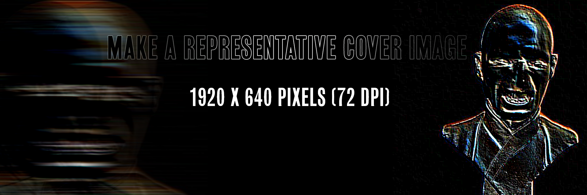

# TITLE HERE Example README.md Outline

### Table of Contents
1. [Artefact](#Artefact)
    1. [Metadata](#Metadata)
2. [Research](#Research-h1)
3. [Transcoding](#Transcoding)
    1. [Transcoding No. 1](#Transcoding-no-1)
    2. [Transcoding Tool](#Transcoding-tool)
4. [Reflection](#Reflection)
5. [Outcome](#Outcome)
6. [Conclusion](#Conclusion)
7. [Bibliography](#Bibliography)

# Artefact
A collection of =/- 10 artefacts collected by me, which are focussed on the tensions between the Eastern and Western fronts during memorable/important moments in the Cold War. These artefacts vary from posters to drawings to images.

You should include a short introduction about your artefact here. Keep in mind: there is space in the metadata (below) to include the 'formal' or 'physical' description. In your [Research](#Research-h1) section (even lower below) you can expand on the context, history and relevant information for the audience. This little introduction here should have a short, overview quality. Just enough to give a clear overview, before getting into details.  

## Metadata
| Tag | Data |  
|--|--|
**IISG Call Number** | [IISG BG K21/985](https://search.iisg.amsterdam/Record/1109411)
| **Physical Description** | Copper Bust
| **Type** | Object
| **Medium** | Sculpture
| **Materials** | Copper, Steel
| **Date** | 1912
|| This is literally a description of what you see in the image, make sure its a clear, complete and concise overview of the artefact. It should make sense for someone who doesn't see the image itself.  Our final *Catalogue of Resilience* might make use of one representative image from each student, so important to put your moneyshot here. You can build a gallery of additional artefact images below.

# Research (H1)
My original artefact was a 'Kienspel' (Dutch for a boardgame, similar to Bingo), from the International Organisation of Good Templars, whose international body is known as Movendi International, is a fraternal organization which is part of the temperance movement, promoting abstinence from alcohol and other drugs. While I was getting more information on the IOGT I found out that they used this boardgame to gain extra cash income for their organisation and also used as an tool to gather and force their followers to meet more often, since it is a gambling game, people are more likely to come more often to play. While I was looking at the history of games I found interesting articles about how a lot of governments use games as propaganda and as a tool for recruitment. I figured I was not so interested in the actual movement of IOGT, but rather their use a of a game as a tool for propaganda, so I continued my research and found articles about how the Soviet Union, under Stalin's power used socialist realism, a particular form of propaganda disguised as art that glorified the Soviet state and party, its workers, and depicted scenes from everyday life.

Now I was getting excited, I learned a lot of historical facts which I either had forgotten or never learned, but my research did not end here, because again I found a new entry point, which has a lot of propaganda and power struggles, because I wanted my video game to have a more global view, a good topic to show propaganda from 'both' sides of the world: The Cold War. I focussed my research on the first part of the Cold War; on the NATO and Warsaw Pact, the Space Race and the Arms Race.

This section consolidates the background research, context and any relevant information regarding your research **into** the artefact.

## Research Sub-Heading (H2)
Its important to give a clear structure to your Readme. Please use the document structure provided by markdown, so think of Headings, Sub-headings, text, bold/italic, lists (bullets and numbered), tables etc. You can also include some linked footnotes like this. [[1]](#footnote-1)

### Research Sub-sub-heading (H3)
The H3 heading is useful to define specific subsections within the H2 section. If you are in doubt about information structure, take a look at different wikipedia articles for reference.

# Transcoding
I started my transcoding with a mindmap regarding the tensions between the Eastern and Western fronts. See image
My transcoding process was a bit unusual, I started from a Bingo artefact from the International Organisation of Good Templars, in this bingo game I found out that the IOGT used this bingo game as a leverage on their followers giving them an extra cash income + more gatherings of their followers. Unfortunately the object itself was not worth transcoding/basing my whole project on. From this point on I had quite a intensive research in the manifestation of propaganda in video games, which I was deeply interested in. After this I deepened my research into propaganda and arrived at propaganda during wartime and eventually the Cold War, which sprouted with propaganda. Now to start looking for a whole new artefact and topic would be a pity... I had the topic and idea to make a game about the Cold War, so I started looking for artefacts regarding the Cold War.

Please include a general description of the role of transcoding in your project. Using the H2 headings below, you can specify individual Transcoding experiments. Think about your motivations in transcoding, and mention the role of tools (also those made during the assignment). This gives some direction to the reader about what they will read in more detail below.

## Transcoding No. 1
### Description
Short description here. You can structure the information and documentation for each transcoding, design research or coding tool as you like. It's important that you make clear the aims & goals of the transcoding, what methods and tools you use. If this is often the same across different transcodings, consider making a standardised table at the beginning of each.

You should include well-formatted documentation of your experiments and developments below. Someone without previous knowledge about your work should be able to follow along the steps, aims and results of your developments from this structure. Make sure all media used is correctly linked or embedded (images, PDFs, Videos, etc).

### Methods
Description of your methods, documentation of behind-the-scenes processes can go here. Think of the photos and videos you made when visiting the IISG or during captures of your artefact. You can use tools such as [Gifs.com](https://gifs.com/) to generate moving-image thumbnail to link to short videos.Just enough to give a clear overview, before getting into details.  

With some HTML tags you can do simple styling in markdown, for example:

    <width="50%">

Remember to include the url link to jump to the full media, of course!

### Tools
The tools that I have used for this projects are TextEdit programs, to format and write HTML, CSS and JS. For the transcodings I used photoshop, to make sketches and Blender to model and texture props for my videogame.
To make a videogame I used Unity for the visual creating and Visual Studio to code and format my C#.

Mention the tools that you used or made (if and when relevant).

### Results
Some of your transcoding experiments may have smaller outcome sketches like images or short video tests. They can go directly within this section. Or maybe this transcoding became a part of the final outcome format. When that is the case, you can simply include a [hyperlink](#) to the final outcomes in the **Transcoding** section. In the final outcome section below you can embed or explain the final format outcome in detail.  

## Transcoding Tool
### Description
My transcoding tool was mainly Blender this semester, to make useable models

You might have made multiple coding tools during the semester. Or the transcoding tool might be part of a specific transcoding experiment itself. It's up to you to define the linear flow of the Readme. Just like the transcoding of media itself, the coding tool should be well documented. So if you are using a coding tool in your first experiment, include the documentation of the coding tool **before** you include the results, etc.

### Aims
The tool is made for getting a better understanding of artefacts from the Cold war in the IISG, combing them into one world to see how they function together.

Include the main aims or intentions behind making the tool, and what it is used for.

### Methods
C# WebGL
This includes the coding languages, coding frameworks or libraries, and any platforms or webtools for example.   

### Results
My result is combining my transcoded models into a video game about the Cold War.
The coding tool will vary a lot between different students. So depending on the use and type, you may include more or less documentation here.

### Source Links
https://unity.com/
https://visualstudio.microsoft.com/vs/
https://www.youtube.com/watch?v=GKH08fMkd4I&list=PL-9tAEcwCavo82iPBt3gh06Z8g53VW0X7&index=9&t=0s
https://www.youtube.com/watch?v=NcOiFBu4L84&list=PL-9tAEcwCavo82iPBt3gh06Z8g53VW0X7&index=24&t=0s
https://www.youtube.com/watch?v=DLgDGUgUeX0&list=PL-9tAEcwCavo82iPBt3gh06Z8g53VW0X7&index=25&t=0s
https://www.youtube.com/watch?v=VbZ9_C4-Qbo&list=PLsdG5n9AbYWPh7-UFkBcXeq7BUHRnT0v9&index=5&t=0s

Please include links to the tools, sources etc used during the coding. E.g. the resources used for making your coding tool.  

# Reflection
During this process I focussed a lot on the research and conceptual part of this project instead of focussing purely on the visual side, which is my 'normal' way of working, therefor I challenged myself and ran into problems which I have not encountered so far in my studies, which at times could be quite annoying, but also motivating.

You might want to include a section about reflecting on the results of your coding and IMD experiments this semester. It can give additional context before reading the final outcomes below.

# Outcomes
The outcome of this transcoding and toolmaking assignment is a game made in Unity, formatte with C#, filled with artefacts from the IISG library regarding the topics of the Cold War. This game will take you through multiple encounters to gain additional insights, which are not shown in the metadata in the collections from the IISG.

This section will be different for each student, depending on how and what is formatted as a final result for the semester assignment. Nevertheless a clear written and documented outcomes is important. So give the appropriate subsections or formats to make this as thorough as possible.

### Outcome Links
Here you link to your final assignment outcomes. This could be a website, a video, etc etc. Please include links to the appropriate GitHub folder on your repository where your coding tool is stored.

This is the main way to access your IMD + Coding outcomes for the semester. So its very important that you check for bugs, troubleshoot hyperlink issues, embedded media issues etc. Please make sure you KNOW where each file you use is stored. E.g. If you migrated from Notion markdown into GitHub, its **VERY IMPORTANT** to know that Notion randomly stores images on an Amazon server. It changes those locations all the time. So if your main outcome or documentation is still grabbing those links, **its very likely** they might disappear before collectives. So please have all media and necessary files managed well in your own locations (online or github etc).   

# Conclusion
During this project I learned how to work with a rather hard to research archive, from the IISG. Learned new software; Blender, to make models of the artefacts. Unity, combined with Visual Studio to make a video game. I found out that making a proper functioning video game is quite a tedious and time consuming thing, but also a rewarding experience.

You might have a nice conclusive observation to share at the end :)

## Bibliography
Of course, as with all research work please include a good bibliography with links, and any references that were used or might give additional depth to the work.

<a name="footnote-1">**[1]**</a>: Look at this little referenced footnote over here. You can look up different text formats for referencing books, online articles, films etc.
